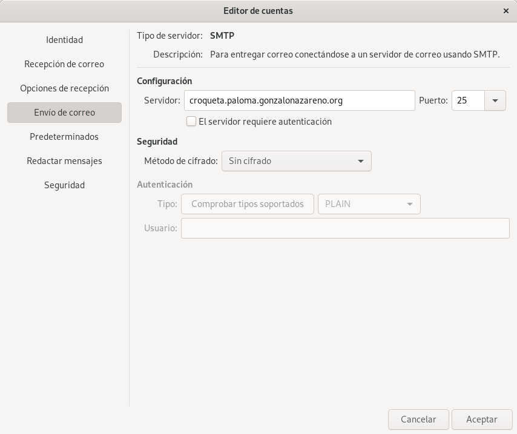
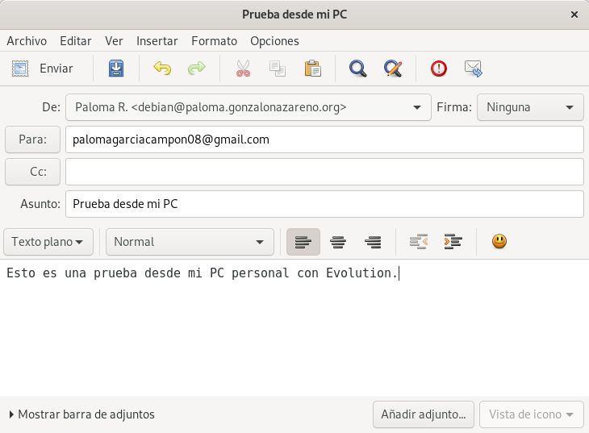

# Servidor de correos en los servidores cloud
- El servidor de correos se va a instalar en croqueta (debian)

- Los servidores que necesites para realizar la práctica serán los del cloud: salmorejo (servidor web) y croqueta (servidor dns y ldap).

Vamos a realizar un sistema de correo para el dominio tudominio.gonzalonazareno.org, cuyo servidor DNS lo adm
inistras en tu propio servidor DNS. Tienes que comunicar el nombre de dominio al profesor para configurar el servidor de correos del departamento. Instala postfix y comprueba que recibe correo directamente desde un equipo de Internet (hotmail, gmail, etc.). Configura tu servidor de correos para que use a babuino-smtp como relay y comprueba que puedes enviar correos.

**Documenta en redmine una prueba de funcionamiento, donde envíes desde tu servidor local al exterior. Muestra el log donde se vea el envío. Muestra el correo que has recibido.**
En el fichero de configuracion del DNS se va a añadir la siguiente línea:
~~~
@               IN  MX      10 croqueta
~~~

Para instalar **postfix**:
~~~
debian@croqueta:~$ sudo apt install postfix
~~~

Se selecciona el tipo de configuración Internet Site:
~~~
 ┌──────────────────────┤ Postfix Configuration ├──────────────────────┐
 │ Please select the mail server configuration type that best meets    │ 
 │ your needs.                                                         │ 
 │                                                                     │ 
 │  No configuration:                                                  │ 
 │   Should be chosen to leave the current configuration unchanged.    │ 
 │  Internet site:                                                     │ 
 │   Mail is sent and received directly using SMTP.                    │ 
 │  Internet with smarthost:                                           │ 
 │   Mail is received directly using SMTP or by running a utility      │ 
 │ such                                                                │ 
 │   as fetchmail. Outgoing mail is sent using a smarthost.            │ 
 │  Satellite system:                                                  │ 
 │   All mail is sent to another machine, called a 'smarthost', for    │ 
 │ delivery.                                                           │ 
 │  Local only:                                                        │ 
 │   The only delivered mail is the mail for local users. There is no  │ 
 │ network.                                                            │ 
 │                                                                     │ 
 │ General type of mail configuration:                                 │ 
 │                                                                     │ 
 │                      No configuration                               │ 
 │                      Internet Site                                  │ 
 │                      Internet with smarthost                        │ 
 │                      Satellite system                               │ 
 │                      Local only                                     │ 
 │                                                                     │ 
 │                                                                     │ 
 │                  <Ok>                      <Cancel>                 │ 
 │                                                                     │ 
 └─────────────────────────────────────────────────────────────────────┘ 
 ┌──────────────────────┤ Postfix Configuration ├──────────────────────┐
 │ The "mail name" is the domain name used to "qualify" _ALL_ mail     │ 
 │ addresses without a domain name. This includes mail to and from     │ 
 │ <root>: please do not make your machine send out mail from          │ 
 │ root@example.org unless root@example.org has told you to.           │ 
 │                                                                     │ 
 │ This name will also be used by other programs. It should be the     │ 
 │ single, fully qualified domain name (FQDN).                         │ 
 │                                                                     │ 
 │ Thus, if a mail address on the local host is foo@example.org, the   │ 
 │ correct value for this option would be example.org.                 │ 
 │                                                                     │ 
 │ System mail name:                                                   │ 
 │                                                                     │ 
 │ croqueta.paloma.gonzalonazareno.org________________________________ │ 
 │                                                                     │ 
 │                  <Ok>                      <Cancel>                 │ 
 │                                                                     │ 
 └─────────────────────────────────────────────────────────────────────┘ 
~~~

El nombre del correo está en **/etc/mailname** y los ficheros de configuración de postfix se encuentran en **/etc/postfix**.

En **/etc/postfix/main.cf** se configuran las siguinetes líneas:
~~~
myhostname = croqueta.paloma.gonzalonazareno.org
relayhost = babuino-smtp.gonzalonazareno.org
~~~

Y se reinicia el servicio de postfix.

A continuación se va a realizar una prueba desde un cliente local a un correo de gmail:
~~~
debian@croqueta:~$ mail palomagarciacampon08@gmail.com
Cc: 
Subject: Prueba
Estoy haciendo mi propio servidor de correo. El mundo es maravilloso.
~~~

Y observamos el correo enviado a la dirección de gmail:

**Documenta en redmine una prueba de funcionamiento, donde envíes un correo desde el exterior (gmail, hotmail,…) a tu servidor local. Muestra el log donde se vea el envío. Muestra cómo has leído el correo.**
Se responde al correo anterior. 

Y esto es la información que aparece en los log:
~~~
Feb 20 17:36:01 croqueta postfix/smtpd[2991]: connect from babuino-smtp.gonzalonazareno.org[192.168.203.3]
Feb 20 17:36:01 croqueta postfix/smtpd[2991]: B999C21C14: client=babuino-smtp.gonzalonazareno.org[192.168.203.3]
Feb 20 17:36:01 croqueta postfix/cleanup[2999]: B999C21C14: message-id=<CAN7Hy62iAfUHxnQuhPpwYy8wzhPEq1yic_U3x5Af5qE7s6rKsQ@mail.gmail.com>
Feb 20 17:36:01 croqueta postfix/qmgr[14980]: B999C21C14: from=<palomagarciacampon08@gmail.com>, size=5962, nrcpt=1 (queue active)
Feb 20 17:36:01 croqueta postfix/smtpd[2991]: disconnect from babuino-smtp.gonzalonazareno.org[192.168.203.3] ehlo=1 mail=1 rcpt=1 data=1 quit=1 commands=5
Feb 20 17:36:01 croqueta postfix/local[3000]: B999C21C14: to=<debian@croqueta.paloma.gonzalonazareno.org>, relay=local, delay=0.17, delays=0.1/0.01/0/0.06, dsn=2.0.0, status=sent (delivered to mailbox)
Feb 20 17:36:01 croqueta postfix/qmgr[14980]: BA53321C14: removed
~~~

Se lee el correo de la siguiente forma:
~~~
From: Paloma Garcia <palomagarciacampon08@gmail.com>
Date: Thu, 20 Feb 2020 18:47:51 +0100
Message-ID: <CAN7Hy60Fe63Y_r-dH0twUV0fd0uWYqnMe1nYiWk5rX9-wwB+-Q@mail.gmail.com>
Subject: Respuesta
To: Debian <debian@croqueta.paloma.gonzalonazareno.org>
Content-Type: multipart/alternative; boundary="000000000000a780b9059f0581db"
Status: O
X-UID: 7

--000000000000a780b9059f0581db
Content-Type: text/html; charset="UTF-8"

No mientas, estas estudiando ASIR. 

--000000000000a780b9059f0581db--
~~~

Instala y configura un servidor dovecot POP e IMAP en tu equipo. Configura adecuadamente un cliente de correo (evolution, outlook, thunderbird, …) para que reciba el correo a través de POP o IMAP. El cliente debe estar configurado en una máquina cliente. Nombra en tu servidor DNS al servidor smtp, pop e imap.

Se instalan los siguentes paquetes para POP e IMAP:
~~~
debian@croqueta:~$ sudo apt install dovecot-imapd dovecot-pop3d dovecot-core
~~~

Se añaden la siguiente línea en el fichero de configuración de postfix indicando las direcciones de los clientes que se van a permitir:
~~~
mynetworks = 127.0.0.0/8 [::ffff:127.0.0.0]/104 [::1]/128 10.0.0.0/24 172.22.0.0/16
mailbox_command =
home_mailbox = Maildir/
~~~

También se configura el fichero **/etc/dovecot/conf.d/10-auth.conf**:
~~~
disable_plaintext_auth = no 
~~~

Y se cambia el fichero **/etc/dovecot/conf.d/10-mail.conf**:
~~~ 
mail_location = maildir:~/Maildir             
~~~

Y se modifica el fichero de configuración del DNS:
~~~
pop             IN  CNAME   croqueta
imap            IN  CNAME   croqueta
~~~

> Se necesita que los puertos de POP (110) e IMAP (143) estén abiertos.

Y se reinician todos los servicios (postfix, dovecot, DNS):
~~~
debian@croqueta:~$ sudo rndc reload
debian@croqueta:~$ sudo systemctl restart postfix
debian@croqueta:~$ sudo systemctl restart dovecot.service 
~~~

**Documenta en redmine una prueba de funcionamiento, donde envíes desde tu cliente de correos al exterior. ¿Cómo se llama el servidor para enviar el correo? (Muestra la configuración).**
A continuación, desde otra máquina, se va a acceder al correo desde **Evolution**. En la pestaña **Archivo** > **Nuevo** > **Cuenta de Correo** y aparece una nueva ventana donde indicar los datos del correo:

Y se envía un correo:

Así llega al correo de gmail:

**Documenta en redmine una prueba de funcionamiento, donde recibas un correo desde el exterior (gmail, hotmail,…) y lo leas en tu cliente de correo. Utiliza el protocolo POP. ¿Cómo se llama el servidor para enviar el correo? (Muestra la configuración). Muestra una prueba de funcionamiento de cómo funciona el protocolo POP.**
Ahora se va a enviar un correo desde gmail:

En Evolution se pulsa el botón Enviar/Recibir, donde se pedirá la contraseña del usuario.

**Documenta en redmine una prueba de funcionamiento, donde recibas un correo desde el exterior (gmail, hotmail,…) y lo leas en tu cliente de correo. Utiliza el protocolo IMAP. ¿Cómo se llama el servidor para enviar el correo? (Muestra la configuración). Muestra una prueba de funcionamiento de cómo funciona el protocolo IMAP.**

El protocolo POP guarda los correos recibidos en el directorio de correos donde se ha indicado anteriormente /new. Cuando se descargan esos correos en Evolution estos desaparecen de este direcorio:
- Antes de descargar los correos:
~~~
debian@croqueta:~$ ls Maildir/new/
1582277459.Vfe01I21f10M926773.croqueta
~~~

- Después de descargar los correos:
~~~
debian@croqueta:~$ ls Maildir/new/
debian@croqueta:~$ ls -l Maildir/cur/
total 0
~~~

A continuacion, se va a configurar Evolution con IMAP para probar que el comportameinto tras la descarga de los correos es diferente.

Se añade una nueva cuenta como antes pero en vez de POP se indica IMAP:

Se envía el correo:

Se recibe en evolution:

Y se comprueba que en Mail/cur/ aparecen los mesajes descargados en Evolution:
~~~
debian@croqueta:~$ ls -l Maildir/cur/
total 8
-rw------- 1 debian debian 3138 Feb 21 10:07 1582279626.Vfe01I21f10M647841.croqueta:2,S
-rw------- 1 debian debian 3144 Feb 21 10:10 1582279821.Vfe01I21f0dM770200.croqueta:2,
~~~
